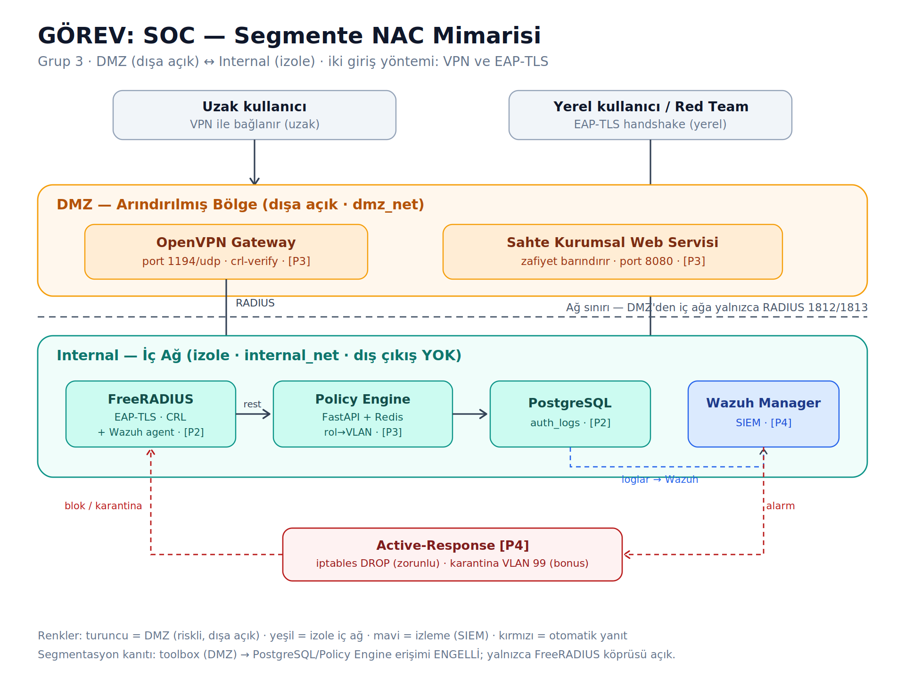

# Mimari — Segmente NAC Altyapısı (Grup 3)

## Genel bakış
Sistem, bir kullanıcının iki yöntemden biriyle (uzak → OpenVPN, yerel → EAP-TLS) bağlandığında kimliğini dinamik olarak doğrulayan, rolüne göre bir VLAN/erişim profiline atayan ve saldırıları tespit edip otomatik olarak engelleyen segmente bir ağ erişim kontrol (NAC) altyapısıdır.

## Ağ bölgeleri
Docker ağı iki izole bölgeye ayrılır:

**DMZ (`dmz_net`, bridge — dışa açık).** İnternete bakan OpenVPN Gateway ve bilinçli olarak zafiyet barındıran sahte "Kurumsal Web Servisi" burada konumlanır. Red Team'in dış saldırı yüzeyi budur.

**Internal (`internal_net`, `internal: true` — dış çıkışı yok).** FreeRADIUS, Policy Engine (FastAPI+Redis), PostgreSQL ve Wazuh Manager burada izole edilir. Bu ağ dış dünyaya çıkamaz.

**Köprü.** FreeRADIUS tek köprü servistir; hem `dmz_net` hem `internal_net` üzerindedir. DMZ'den iç ağa erişim yalnızca RADIUS portu (1812/1813) üzerinden, yani sadece FreeRADIUS aracılığıyla mümkündür. PostgreSQL ve Policy Engine host'a veya DMZ'ye hiçbir port açmaz.

## Kimlik doğrulama akışı
1. Kullanıcı OpenVPN (uzak) veya EAP-TLS (yerel) ile bağlanır.
2. İstek FreeRADIUS'a ulaşır; sertifika doğrulanır (CRL ile iptal/expired kontrolü dahil).
3. FreeRADIUS `rlm_rest` ile Policy Engine'in `POST /authorize` ucuna sorar.
4. Policy Engine sertifika CN'inden rolü çıkarır (`admin/employee/guest`), uygun VLAN'ı belirler, Redis sayacını günceller, kararı PostgreSQL `auth_logs`'a yazar.
5. FreeRADIUS, VLAN/erişim profilini yanıt olarak döndürür.

## Dinamik politika
Rol → VLAN eşlemesi tüm sistemde tek kaynaktan tutarlıdır: `admin → VLAN 10`, `employee → VLAN 20`, `guest → VLAN 30`, `quarantine → VLAN 99`. Bu tablo DB seed, policy-engine ve freeradius'ta birebir aynıdır.

## Tespit ve yanıt (SOC)
OpenVPN, RADIUS ve Policy Engine logları paylaşılan volume'lar üzerinden Wazuh Manager'a akar. Ardışık başarısız sertifika/kimlik denemeleri (Redis rate-limit ile) Wazuh'ta "Kritik Ağ İhlali (Certificate Spoofing / Brute-Force / Unauthorized Access)" alarmı üretir. Eşik aşıldığında active-response, saldırganın IP'sini FreeRADIUS konteynerindeki agent üzerinde iptables ile bloklar (choke point orasıdır, saldırganın gerçek IP'si orada görünür). Bonus olarak bağlantı tamamen kesilmek yerine karantina VLAN'ına (99) yönlendirilebilir.

## Segmentasyon kanıtı
`toolbox` konteyneri DMZ'de bir saldırgan makinesi gibi davranır. `redteam/segmentation_test.sh`, DMZ'den `db:5432` ve `policy-engine:8000`'e doğrudan erişimin **başarısız**, `radius:1812`'ye erişimin **başarılı** olduğunu göstererek ağ segmentasyonunu kanıtlar.

## Gerçek dünya kullanım alanları
Bu mimari; hastane ağlarında tıbbi cihaz/personel erişiminin role göre ayrıştırılması, kurumsal ağlarda misafir/çalışan/yönetici VLAN segmentasyonu ve uzaktan çalışma senaryolarında sertifika tabanlı sıfır güven (zero-trust) erişim kontrolü gibi durumlara uygulanabilir.
